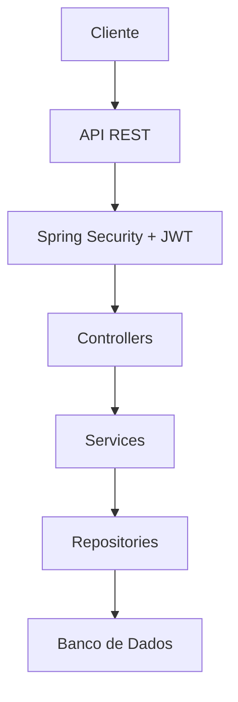

# 🚀 API Rest Forum ONE

[](https://github.com/seu-usuario/seu-repo)
[](https://www.oracle.com/java/)
[](https://spring.io/projects/spring-boot)
[](LICENSE)

Projeto parte do **ONE | TECH FOUNDATION - Especialização Back-End**. Esta API RESTful permite a criação e gerenciamento de um fórum online, com funcionalidades de autenticação, usuários e tópicos. Desenvolvida em Java com Spring Boot, inclui segurança JWT, banco de dados relacional e endpoints bem estruturados para operações CRUD.

## 📋 Descrição

A API facilita a interação em um fórum, permitindo que usuários se cadastrem, façam login, criem tópicos de discussão e gerenciem conteúdos. Ideal para aplicações de comunidades online, com foco em segurança e escalabilidade.

### 🎯 Principais Características
- **Autenticação Segura**: Login com geração de tokens JWT.
- **Gerenciamento de Usuários**: Cadastro, atualização, listagem e exclusão.
- **Gerenciamento de Tópicos**: Criação, atualização, listagem e exclusão de tópicos.
- **Banco de Dados**: Integração com banco relacional (usando Flyway para migrações).
- **Segurança**: Filtros de segurança e tratamento de erros.

## 🛠️ Tecnologias Utilizadas

- **Java 17**: Linguagem principal.
- **Spring Boot**: Framework para desenvolvimento rápido de APIs.
- **Spring Security**: Para autenticação e autorização.
- **JWT (JSON Web Tokens)**: Para tokens de acesso.
- **JPA/Hibernate**: Para mapeamento objeto-relacional.
- **Flyway**: Para migrações de banco de dados.
- **Maven**: Gerenciamento de dependências e build.
- **H2/MySQL**: Banco de dados (configurável via `application.properties`).

## 🚀 Como Executar o Projeto

### Pré-requisitos
- Java 17 ou superior instalado.
- Maven instalado.
- Banco de dados configurado (ex.: H2 para desenvolvimento).

### Passos para Execução
1. **Clone o repositório**:
   ```bash
   git clone https://github.com/seu-usuario/seu-repo.git
   cd api
   ```

2. **Configure o banco de dados**:
   - Edite `src/main/resources/application.properties` para definir a conexão com o banco (ex.: H2 ou MySQL).

3. **Execute as migrações**:
   ```bash
   ./mvnw flyway:migrate
   ```

4. **Compile e execute a aplicação**:
   ```bash
   ./mvnw spring-boot:run
   ```

5. **Acesse a API**:
   - Base URL: `http://localhost:8080`
   - Use ferramentas como Insomnia ou Postman para testar os endpoints.

### 🧪 Testes
Execute os testes com:
```bash
./mvnw test
```

## 📚 Documentação da API

A API utiliza RESTful design. Aqui estão os principais endpoints:

### Autenticação
- `POST /login`: Faz login e retorna um token JWT.
  - Corpo: `{ "email": "usuario@email.com", "senha": "senha" }`

### Usuários
- `POST /usuarios`: Cadastra um novo usuário.
- `GET /usuarios`: Lista todos os usuários (autenticado).
- `PUT /usuarios/{id}`: Atualiza um usuário.
- `DELETE /usuarios/{id}`: Exclui um usuário.

### Tópicos
- `POST /topicos`: Cria um novo tópico.
- `GET /topicos`: Lista tópicos (com paginação).
- `PUT /topicos/{id}`: Atualiza um tópico.
- `DELETE /topicos/{id}`: Exclui um tópico.

Para mais detalhes, consulte o código-fonte nos controllers (`AutenticacaoController.java`, `TopicoController.java`, etc.).

## 📸 Funcionamento da Aplicação (Exemplos Visuais)

Usando o Insomnia para simular requisições:

### Criação de um Tópico


### Atualização de um Tópico


### Listagem de Tópicos


### Login com Token


## 🏗️ Estrutura do Projeto

```
api/
├── src/main/java/forum/vel/api/
│   ├── controller/          # Endpoints da API
│   ├── infra/               # Configurações de segurança e tratamento de erros
│   ├── model/               # Entidades e DTOs (usuários, tópicos, cursos)
│   └── repository/          # Interfaces de repositório JPA
├── src/main/resources/
│   ├── application.properties  # Configurações da aplicação
│   └── db/migration/           # Scripts de migração Flyway
└── pom.xml                    # Dependências Maven
```

### Diagrama de Arquitetura (Simples)


## 🤝 Contribuição

Contribuições são bem-vindas! Siga estes passos:
1. Fork o projeto.
2. Crie uma branch para sua feature (`git checkout -b feature/nova-funcionalidade`).
3. Commit suas mudanças (`git commit -m 'Adiciona nova funcionalidade'`).
4. Push para a branch (`git push origin feature/nova-funcionalidade`).
5. Abra um Pull Request.

## 📄 Licença

Este projeto está sob a licença MIT. Veja o arquivo [LICENSE](LICENSE) para mais detalhes.

## 📞 Contato

- **Autor**: Seu Nome
- **Email**: seu.email@example.com
- **LinkedIn**: [Seu LinkedIn](https://linkedin.com/in/seu-perfil)

---

⭐ Se este projeto foi útil, dê uma estrela no repositório!
